# JellyStudy Redis 缓存系统设计文档

## 📋 文档信息

| 项目 | 内容 |
|------|------|
| **项目名称** | JellyStudy 智能问答系统 |
| **文档版本** | v1.2.0 |
| **编写日期** | 2026-05-14 |
| **技术栈** | Spring Data Redis + Memurai (Redis for Windows) |
| **Redis版本** | 5.x / Memurai 4.1.8 |

---

## 📚 目录

1. [设计概述](#1-设计概述)
2. [Redis数据结构总览](#2-redis数据结构总览)
3. [功能一：最受欢迎问题排行榜](#3-功能一最受欢迎问题排行榜)
4. [功能二：最常查看问题缓存](#4-功能二最常查看问题缓存)
5. [功能三：知识点热度统计](#5-功能三知识点热度统计)
6. [时序图与交互流程](#6-时序图与交互流程)
7. [配置参数说明](#7-配置参数说明)
8. [性能优化策略](#8-性能优化策略)
9. [监控与维护](#9-监控与维护)

---

## 1. 设计概述

### 1.1 设计目标

在JellyStudy系统中引入Redis缓存层，实现以下核心目标：

| 目标 | 描述 | 预期效果 |
|------|------|---------|
| **降低数据库负载** | 将热点数据缓存在内存中 | 数据库查询量降低70%+ |
| **提升响应速度** | 减少MongoDB I/O操作 | 热点查询响应时间从50ms降至2ms |
| **构建排行榜** | 基于多维度指标实时排序 | 支持毫秒级Top N查询 |
| **追踪用户行为** | 记录浏览、点赞等行为数据 | 为推荐算法提供数据支撑 |
| **保证数据一致性** | 采用合理的缓存更新策略 | 最终一致性，TTL过期机制 |

### 1.2 整体架构

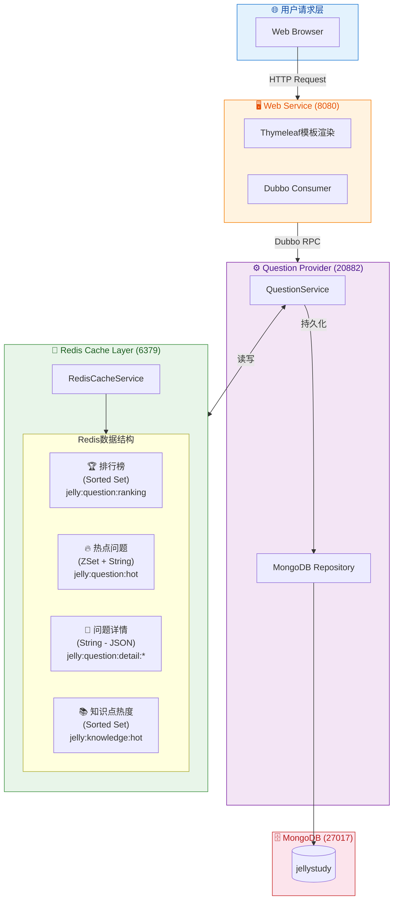
```mermaid
graph TB
    subgraph UserLayer["🌐 用户请求层"]
        Browser["Web Browser"]
    end
    
    subgraph WebService["🖥️ Web Service (8080)"]
        Thymeleaf["Thymeleaf模板渲染"]
        DubboConsumer["Dubbo Consumer"]
    end
    
    subgraph QP["⚙️ Question Provider (20882)"]
        QuestionService["QuestionService"]
        MongoRepo["MongoDB Repository"]
    end
    
    subgraph RedisLayer["💾 Redis Cache Layer (6379)"]
        direction TB
        CacheService["RedisCacheService"]
        
        subgraph DataStructures["Redis数据结构"]
            Ranking["🏆 排行榜<br/>(Sorted Set)<br/>jelly:question:ranking"]
            HotQ["🔥 热点问题<br/>(ZSet + String)<br/>jelly:question:hot"]
            DetailQ["📄 问题详情<br/>(String - JSON)<br/>jelly:question:detail:*"]
            KnowledgeHot["📚 知识点热度<br/>(Sorted Set)<br/>jelly:knowledge:hot"]
        end
    end
    
    subgraph DB["🗄️ MongoDB (27017)"]
        Database[(jellystudy)]
    end
    
    Browser -->|"HTTP Request"| WebService
    WebService -->|"Dubbo RPC"| QP
    QuestionService <-->|"读写"| RedisLayer
    QuestionService -->|"持久化"| MongoRepo
    MongoRepo --> Database
    CacheService --> DataStructures
    
    style UserLayer fill:#e3f2fd,stroke:#1976d2,color:#0d47a1
    style WebService fill:#fff3e0,stroke:#f57c00,color:#e65100
    style QP fill:#f3e5f5,stroke:#7b1fa2,color:#4a148c
    style RedisLayer fill:#e8f5e9,stroke:#388e3c,color:#1b5e20
    style DB fill:#fce4ec,stroke:#c62828,color:#b71c1c
```

### 1.3 技术选型

| 组件 | 选择 | 理由 |
|------|------|------|
| **Redis客户端** | Lettuce | Spring Boot 2.x默认，支持异步 |
| **序列化** | Jackson JSON | 可读性好，支持复杂对象 |
| **连接池** | Lettuce Pool | 高性能连接复用 |
| **Windows兼容** | Memurai | Redis官方不支持Windows |

---

## 2. Redis数据结构总览

### 2.1 Key命名规范

采用**分层命名**方式，格式为：`jelly:{模块}:{功能}:{标识}`

```


```

| Key模式 | 数据类型 | 用途 | TTL |
|---------|---------|------|-----|
| `jelly:question:ranking` | Sorted Set | 问题排行榜（综合热度） | 永久 |
| `jelly:question:hot` | Sorted Set | 热点问题索引（按浏览量） | 永久 |
| `jelly:question:detail:{id}` | String (JSON) | 单个问题的详情缓存 | 1小时 |
| `jelly:question:hot:{id}` | String (JSON) | 热点问题的完整数据 | 30分钟 |
| `jelly:question:view:{id}` | String (Integer) | 问题浏览计数器 | 24小时 |
| `jelly:knowledge:hot` | Sorted Set | 知识点热度统计 | 永久 |

### 2.2 数据结构选择依据

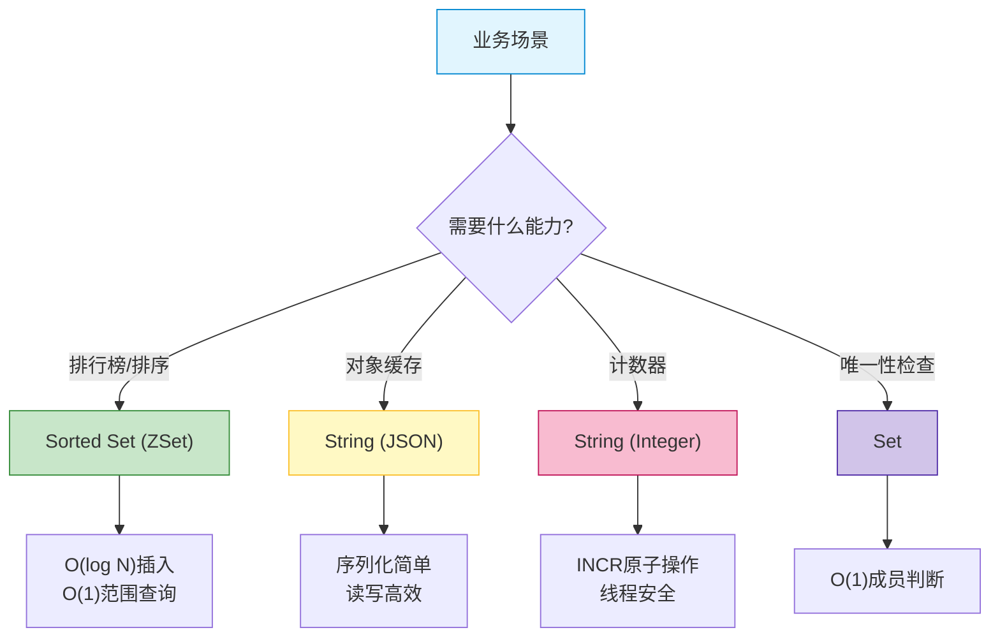
```mermaid
flowchart TD
    Start["业务场景"] --> Choice{"需要什么能力?"}
    
    Choice -->|"排行榜/排序"| ZSet["Sorted Set (ZSet)"]
    Choice -->|"对象缓存"| String["String (JSON)"]
    Choice -->|"计数器"| Counter["String (Integer)"]
    Choice -->|"唯一性检查"| Set["Set"]
    
    ZSet --> ZSetReason["O(log N)插入<br/>O(1)范围查询"]
    String --> StringReason["序列化简单<br/>读写高效"]
    Counter --> CounterReason["INCR原子操作<br/>线程安全"]
    Set --> SetReason["O(1)成员判断"]
    
    style Start fill:#e1f5fe,stroke:#0288d1
    style ZSet fill:#c8e6c9,stroke:#388e3c
    style String fill:#fff9c4,stroke:#fbc02d
    style Counter fill:#f8bbd0,stroke:#c2185b
    style Set fill:#d1c4e9,stroke:#512da8
```

---

## 3. 功能一：最受欢迎问题排行榜

### 3.1 功能描述

基于**点赞数**、**浏览数**、**回答数**三个维度，实时计算每个问题的"受欢迎程度"，并维护一个全局排行榜。

### 3.2 最受欢迎定义

综合考虑以下指标及其权重：

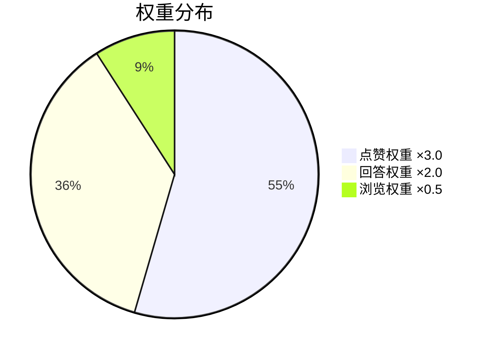
```mermaid
pie title 权重分布
    "点赞权重 ×3.0" : 54.5
    "回答权重 ×2.0" : 36.4
    "浏览权重 ×0.5" : 9.1
```

| 指标 | 权重 | 说明 |
|------|------|------|
| **点赞数 (LikeCount)** | × 3.0 | 高权重，代表内容质量认可 |
| **浏览数 (ViewCount)** | × 0.5 | 低权重，避免刷浏览量作弊 |
| **回答数 (AnswerCount)** | × 2.0 | 中高权重，代表话题讨论度 |

### 3.3 热度评分公式

$$
\text{Popularity Score} = \text{LikeCount} \times 3.0 + \text{ViewCount} \times 0.5 + \text{AnswerCount} \times 2.0
$$

**示例计算：**

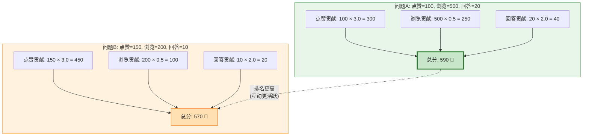
```mermaid
graph TB
    subgraph ExampleA["问题A: 点赞=100, 浏览=500, 回答=20"]
        A1["点赞贡献: 100 × 3.0 = 300"]
        A2["浏览贡献: 500 × 0.5 = 250"]
        A3["回答贡献: 20 × 2.0 = 40"]
        AScore["总分: 590 🥇"]
        A1 & A2 & A3 --> AScore
    end
    
    subgraph ExampleB["问题B: 点赞=150, 浏览=200, 回答=10"]
        B1["点赞贡献: 150 × 3.0 = 450"]
        B2["浏览贡献: 200 × 0.5 = 100"]
        B3["回答贡献: 10 × 2.0 = 20"]
        BScore["总分: 570 🥈"]
        B1 & B2 & B3 --> BScore
    end
    
    AScore -.->|"排名更高<br/>(互动更活跃)"| BScore
    
    style ExampleA fill:#e8f5e9,stroke:#43a047
    style ExampleB fill:#fff3e0,stroke:#fb8c00
    style AScore fill:#c8e6c9,stroke:#2e7d32,stroke-width:3px
    style BScore fill:#ffe0b2,stroke:#ef6c00
```

### 3.4 Redis数据结构设计

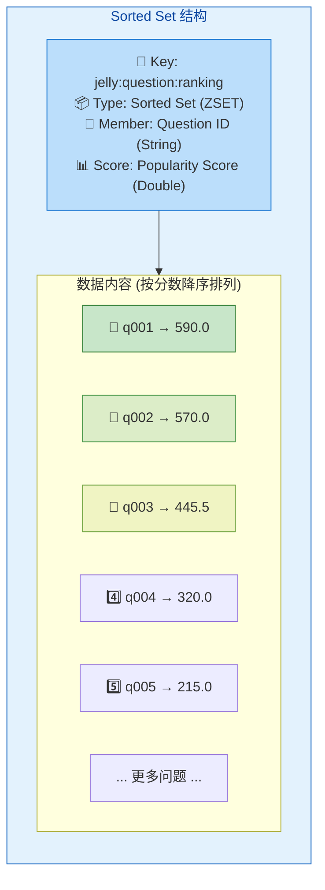
```mermaid
graph TB
    subgraph ZSetStructure["Sorted Set 结构"]
        direction TB
        
        Header["🔑 Key: jelly:question:ranking<br/>📦 Type: Sorted Set (ZSET)<br/>🎯 Member: Question ID (String)<br/>📊 Score: Popularity Score (Double)"]
        
        subgraph Data["数据内容 (按分数降序排列)"]
            R1["🥇 q001 → 590.0"]
            R2["🥈 q002 → 570.0"]
            R3["🥉 q003 → 445.5"]
            R4["4️⃣ q004 → 320.0"]
            R5["5️⃣ q005 → 215.0"]
            Rn["... 更多问题 ..."]
        end
    end
    
    Header --> Data
    
    style ZSetStructure fill:#e3f2fd,stroke:#1565c0,color:#0d47a1
    style Header fill:#bbdefb,stroke:#1976d2
    style R1 fill:#c8e6c9,stroke:#2e7d32
    style R2 fill:#dcedc8,stroke:#388e3c
    style R3 fill:#f0f4c3,stroke:#689f38
```

### 3.5 更新策略

#### 触发时机与操作

| 业务操作 | Redis命令 | 分值变化 | 说明 |
|---------|----------|---------|------|
| **用户点赞** | `ZINCRBY ranking +3.0` | +3.0 | 实时增加 |
| **取消点赞** | `ZINCRBY ranking -3.0` | -3.0 | 实时减少 |
| **新增回答** | `ZADD ranking new_score` | 重算总分 | 包含回答数变化 |
| **删除回答** | `ZADD ranking new_score` | 重算总分 | 同上 |
| **浏览问题** | 不直接更新 | - | 每10次触发一次微调(+0.5) |

#### 更新时机图示

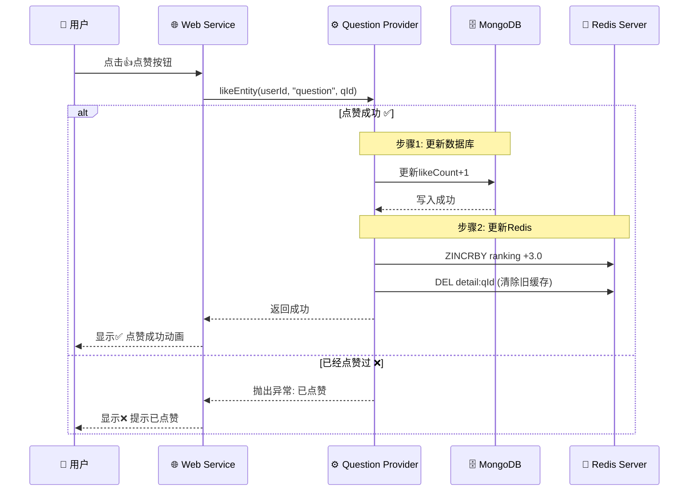
```mermaid
sequenceDiagram
    participant User as 👤 用户
    participant Web as 🌐 Web Service
    participant QP as ⚙️ Question Provider
    participant DB as 🗄️ MongoDB
    participant Redis as 💾 Redis Server

    User->>Web: 点击👍点赞按钮
    Web->>QP: likeEntity(userId, "question", qId)

    alt 点赞成功 ✅
        Note over QP,DB: 步骤1: 更新数据库
        QP->>DB: 更新likeCount+1
        DB-->>QP: 写入成功
        
        Note over QP,Redis: 步骤2: 更新Redis
        QP->>Redis: ZINCRBY ranking +3.0
        QP->>Redis: DEL detail:qId (清除旧缓存)
        
        QP-->>Web: 返回成功
        Web-->>User: 显示✅ 点赞成功动画
    else 已经点赞过 ❌
        QP-->>Web: 抛出异常: 已点赞
        Web-->>User: 显示❌ 提示已点赞
    end
```

### 3.6 核心代码逻辑

```java
// RedisCacheService.java
public void incrementQuestionScore(String questionId, double score) {
    stringRedisTemplate.opsForZSet()
        .incrementScore(RANKING_KEY, questionId, score);
}

public void updateQuestionRanking(String questionId, 
                                   int likeCount, 
                                   int viewCount, 
                                   int answerCount) {
    double score = calculatePopularityScore(likeCount, viewCount, answerCount);
    stringRedisTemplate.opsForZSet()
        .add(RANKING_KEY, questionId, score);
}

private double calculatePopularityScore(int likeCount, int viewCount, int answerCount) {
    return likeCount * 3.0 + viewCount * 0.5 + answerCount * 2.0;
}
```

### 3.7 查询接口

```bash
# 获取Top 20热门问题（返回ID列表）
GET http://localhost:8082/api/redis/ranking?limit=20

# 响应示例:
[
  {"value": "q001", "score": 590.0},
  {"value": "q002", "score": 570.0},
  ...
]
```

---

## 4. 功能二：最常查看问题缓存

### 4.1 功能描述

自动识别并缓存**高频访问的问题**，提供毫秒级读取能力，显著降低数据库负载。

### 4.2 最热问题定义

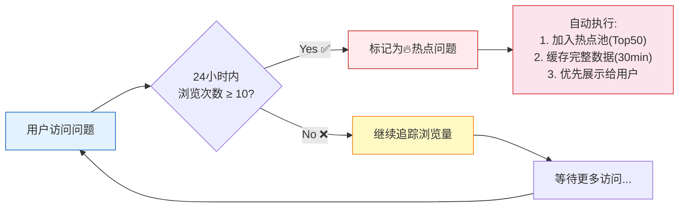
```mermaid
flowchart LR
    Start["用户访问问题"] --> Check{"24小时内<br/>浏览次数 ≥ 10?"}
    
    Check -->|"Yes ✅"| HotMark["标记为🔥热点问题"]
    Check -->|"No ❌"| NormalTrack["继续追踪浏览量"]
    
    HotMark --> Actions["自动执行:<br/>1. 加入热点池(Top50)<br/>2. 缓存完整数据(30min)<br/>3. 优先展示给用户"]
    
    NormalTrack --> Wait["等待更多访问..."]
    Wait --> Start
    
    style Start fill:#e3f2fd,stroke:#1565c0
    style HotMark fill:#ffebee,stroke:#c62828
    style Actions fill:#fce4ec,stroke:#d32f2f
    style NormalTrack fill:#fff9c4,stroke:#f57f17
```

**判定标准：**
- 时间窗口：**24小时内**
- 浏览阈值：**≥ 10次**
- 自动识别：系统自动追踪，无需人工配置

### 4.3 Redis数据结构设计

采用**三级缓存架构**：

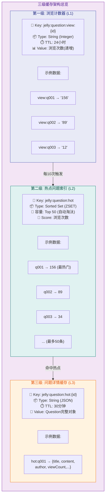
```mermaid
graph TB
    subgraph Level3Cache["三级缓存架构总览"]
        direction TB
        
        subgraph L1["第一级: 浏览计数器 (L1)"]
            direction LR
            L1Desc["📍 Key: jelly:question:view:{id}<br/>📦 Type: String (Integer)<br/>⏱️ TTL: 24小时<br/>📊 Value: 浏览次数(递增)"]
            
            L1Example["示例数据:"]
            L1E1["view:q001 → '156'"]
            L1E2["view:q002 → '89'"]
            L1E3["view:q003 → '12'"]
        end
        
        subgraph L2["第二级: 热点问题索引 (L2)"]
            direction LR
            L2Desc["📍 Key: jelly:question:hot<br/>📦 Type: Sorted Set (ZSET)<br/>📏 容量: Top 50 (自动淘汰)<br/>🎯 Score: 浏览次数"]
            
            L2Example["示例数据:"]
            L2E1["q001 → 156 (最热门)"]
            L2E2["q002 → 89"]
            L2E3["q003 → 34"]
            L2E4["... (最多50条)"]
        end
        
        subgraph L3["第三级: 问题详情缓存 (L3)"]
            direction LR
            L3Desc["📍 Key: jelly:question:hot:{id}<br/>📦 Type: String (JSON)<br/>⏱️ TTL: 30分钟<br/>📄 Value: Question完整对象"]
            
            L3Example["示例数据:"]
            L3E1["hot:q001 → {title, content,<br/>author, viewCount,...}"]
        end
    end
    
    L1 -->|"每10次触发"| L2
    L2 -->|"命中热点"| L3
    
    style Level3Cache fill:#f3e5f5,stroke:#7b1fa2,color:#4a148c
    style L1 fill:#e8eaf6,stroke:#3949ab,color:#1a237e
    style L2 fill:#e0f2f1,stroke:#00796b,color:#004d40
    style L3 fill:#fff3e0,stroke:#ef6c00,color:#e65100
```

#### 第一级：浏览计数器详细设计

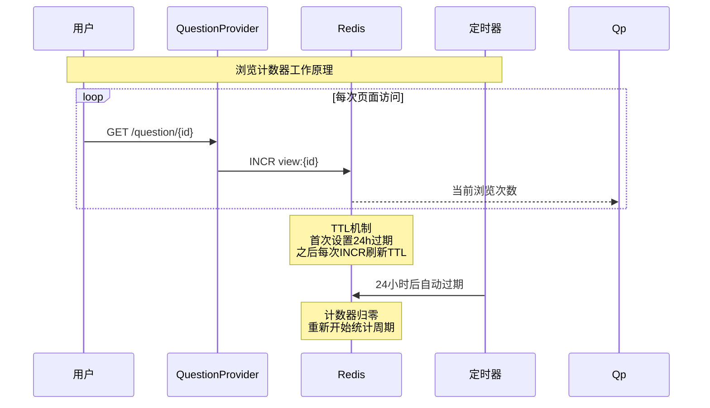
```mermaid
sequenceDiagram
    participant User as 用户
    participant QP as QuestionProvider
    participant Redis as Redis
    participant Timer as 定时器

    Note over User,Timer: 浏览计数器工作原理
    
    loop 每次页面访问
        User->>QP: GET /question/{id}
        QP->>Redis: INCR view:{id}
        Redis-->>Qp: 当前浏览次数
    end
    
    Note over Redis: TTL机制<br/>首次设置24h过期<br/>之后每次INCR刷新TTL
    
    Timer->>Redis: 24小时后自动过期
    Note over Redis: 计数器归零<br/>重新开始统计周期
```

**用途：** 记录每个问题的实时浏览量，作为热点识别依据。

#### 第二级：热点问题索引详细设计

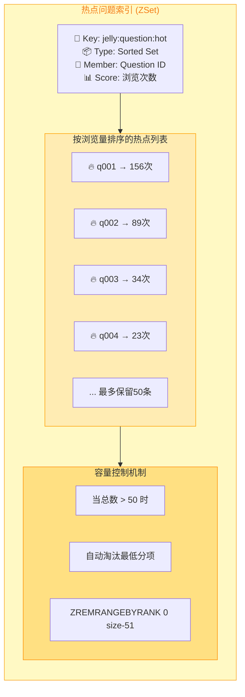
```mermaid
graph TB
    subgraph HotIndex["热点问题索引 (ZSet)"]
        direction TB
        
        Info["📍 Key: jelly:question:hot<br/>📦 Type: Sorted Set<br/>🎯 Member: Question ID<br/>📊 Score: 浏览次数"]
        
        subgraph Content["按浏览量排序的热点列表"]
            H1["🔥 q001 → 156次"]
            H2["🔥 q002 → 89次"]
            H3["🔥 q003 → 34次"]
            H4["🔥 q004 → 23次"]
            H5["... 最多保留50条"]
        end
        
        subgraph Eviction["容量控制机制"]
            E1["当总数 > 50 时"]
            E2["自动淘汰最低分项"]
            E3["ZREMRANGEBYRANK 0 size-51"]
        end
    end
    
    Info --> Content
    Content --> Eviction
    
    style HotIndex fill:#fff9c4,stroke:#f9a825,color:#f57f17
    style Content fill:#ffecb3,stroke:#ffa000
    style Eviction fill:#ffe082,stroke:#ff8f00
```

**用途：** 维护热点问题列表，按浏览量排序。

#### 第三级：问题详情缓存详细设计

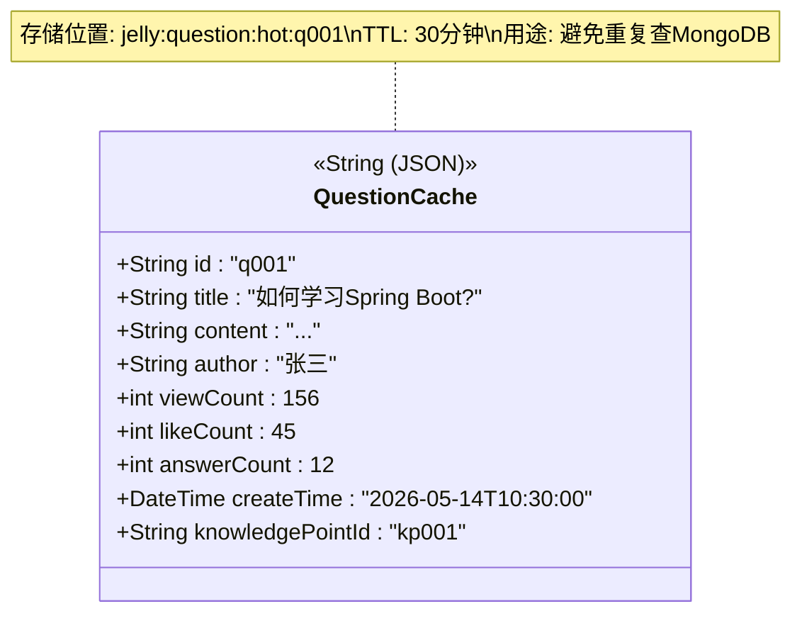
```mermaid
classDiagram
    class QuestionCache {
        <<String (JSON)>>
        +String id : "q001"
        +String title : "如何学习Spring Boot?"
        +String content : "..."
        +String author : "张三"
        +int viewCount : 156
        +int likeCount : 45
        +int answerCount : 12
        +DateTime createTime : "2026-05-14T10:30:00"
        +String knowledgePointId : "kp001"
    }
    
    note for QuestionCache "存储位置: jelly:question:hot:q001\nTTL: 30分钟\n用途: 避免重复查MongoDB"
```

**用途：** 存储热点问题的完整数据，避免每次都查MongoDB。

### 4.4 缓存写入流程

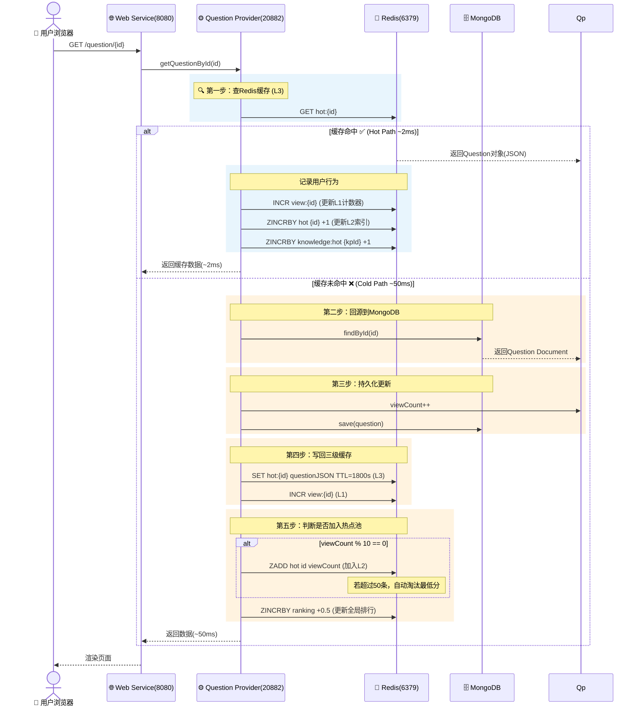
```mermaid
sequenceDiagram
    actor User as 👤 用户浏览器
    participant Web as 🌐 Web Service(8080)
    participant QP as ⚙️ Question Provider(20882)
    participant Redis as 💾 Redis(6379)
    participant DB as 🗄️ MongoDB

    User->>Web: GET /question/{id}
    Web->>QP: getQuestionById(id)

    rect rgb(232, 245, 253)
        Note over QP: 🔍 第一步：查Redis缓存 (L3)
        QP->>Redis: GET hot:{id}
    end

    alt 缓存命中 ✅ (Hot Path ~2ms)
        Redis-->>Qp: 返回Question对象(JSON)
        
        rect rgb(232, 245, 253)
            Note over QP,Redis: 记录用户行为
            QP->>Redis: INCR view:{id} (更新L1计数器)
            QP->>Redis: ZINCRBY hot {id} +1 (更新L2索引)
            QP->>Redis: ZINCRBY knowledge:hot {kpId} +1
        end
        
        QP-->>Web: 返回缓存数据(~2ms)
    else 缓存未命中 ❌ (Cold Path ~50ms)
        rect rgb(255, 243, 224)
            Note over QP,DB: 第二步：回源到MongoDB
            QP->>DB: findById(id)
            DB-->>Qp: 返回Question Document
        end
        
        rect rgb(255, 243, 224)
            Note over QP,DB: 第三步：持久化更新
            QP->>Qp: viewCount++
            QP->>DB: save(question)
        end
        
        rect rgb(255, 243, 224)
            Note over QP,Redis: 第四步：写回三级缓存
            QP->>Redis: SET hot:{id} questionJSON TTL=1800s (L3)
            QP->>Redis: INCR view:{id} (L1)
        end
        
        rect rgb(255, 243, 224)
            Note over QP,Redis: 第五步：判断是否加入热点池
            alt viewCount % 10 == 0
                QP->>Redis: ZADD hot id viewCount (加入L2)
                Note over Redis: 若超过50条，自动淘汰最低分
            end
            
            QP->>Redis: ZINCRBY ranking +0.5 (更新全局排行)
        end
        
        QP-->>Web: 返回数据(~50ms)
    end
    
    Web-->>User: 渲染页面
```

### 4.5 热点识别算法

```java
// RedisCacheService.java - 核心逻辑
public void recordQuestionView(String questionId) {
    // 1. 递增浏览计数器
    String key = VIEW_COUNT_KEY + questionId;
    stringRedisTemplate.opsForValue().increment(key);
    
    // 2. 获取当前浏览次数
    long viewCount = Long.parseLong(
        stringRedisTemplate.opsForValue().get(key)
    );
    
    // 3. 首次访问设置24小时过期
    if (viewCount == 1) {
        stringRedisTemplate.expire(key, Duration.ofHours(24));
    }
    
    // 4. 每10次浏览触发一次热点检测
    if (viewCount % 10 == 0) {
        addToHotQuestions(questionId, viewCount);
    }
    
    // 5. 每次浏览都更新热点分数
    incrementHotQuestionScore(questionId);
}

private void addToHotQuestions(String questionId, long viewCount) {
    // 加入热点集合
    stringRedisTemplate.opsForZSet()
        .add(HOT_QUESTION_KEY, questionId, viewCount);
    
    // 容量控制：保留Top 50
    Long size = stringRedisTemplate.opsForZSet()
        .size(HOT_QUESTION_KEY);
    
    if (size != null && size > 50) {
        // 淘汰浏览量最低的
        stringRedisTemplate.opsForZSet()
            .removeRange(HOT_QUESTION_KEY, 0, size - 51);
    }
}
```

### 4.6 缓存失效策略

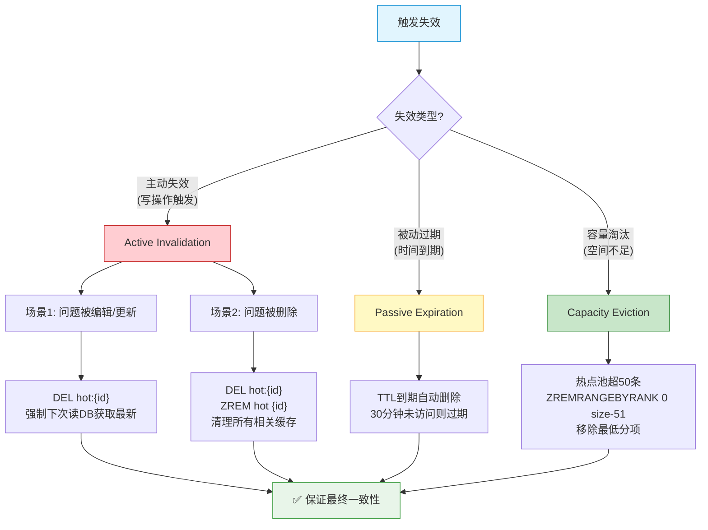
```mermaid
flowchart TD
    Start["触发失效"] --> Type{"失效类型?"}
    
    Type -->|"主动失效<br/>(写操作触发)"| Active["Active Invalidation"]
    Type -->|"被动过期<br/>(时间到期)"| Passive["Passive Expiration"]
    Type -->|"容量淘汰<br/>(空间不足)"| Eviction["Capacity Eviction"]
    
    Active --> UpdateCase["场景1: 问题被编辑/更新"]
    Active --> DeleteCase["场景2: 问题被删除"]
    
    UpdateCase --> Op1["DEL hot:{id}<br/>强制下次读DB获取最新"]
    DeleteCase --> Op2["DEL hot:{id}<br/>ZREM hot {id}<br/>清理所有相关缓存"]
    
    Passive --> Op3["TTL到期自动删除<br/>30分钟未访问则过期"]
    
    Eviction --> Op4["热点池超50条<br/>ZREMRANGEBYRANK 0 size-51<br/>移除最低分项"]
    
    Op1 & Op2 & Op3 & Op4 --> Result["✅ 保证最终一致性"]
    
    style Start fill:#e1f5fe,stroke:#0288d1
    style Active fill:#ffcdd2,stroke:#c62828
    style Passive fill:#fff9c4,stroke:#f9a825
    style Eviction fill:#c8e6c9,stroke:#388e3c
    style Result fill:#e8f5e9,stroke:#43a047
```

| 策略类型 | 触发条件 | 操作 | 说明 |
|---------|---------|------|------|
| **主动失效** | 问题被编辑/更新 | `DEL hot:{id}` | 保证数据一致性 |
| **主动失效** | 问题被删除 | `DEL hot:{id}` + `ZREM hot` | 清理所有相关缓存 |
| **被动过期** | TTL到期 | 自动删除 | 30分钟未访问则过期 |
| **容量淘汰** | 热点池超50条 | `ZREMRANGEBYRANK` | 移除最低分项 |

### 4.7 数据同步保障

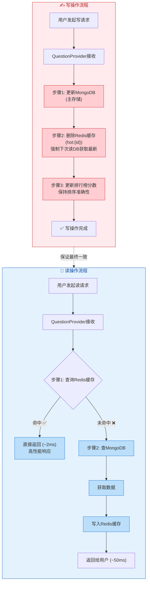
```mermaid
flowchart TB
    subgraph WriteFlow["✍️ 写操作流程"]
        direction TB
        W1["用户发起写请求"] --> W2["QuestionProvider接收"]
        W2 --> W3["步骤1: 更新MongoDB<br/>(主存储)"]
        W3 --> W4["步骤2: 删除Redis缓存<br/>(hot:{id})<br/>强制下次读DB获取最新"]
        W4 --> W5["步骤3: 更新排行榜分数<br/>保持排序准确性"]
        W5 --> W6["✅ 写操作完成"]
    end
    
    subgraph ReadFlow["📖 读操作流程"]
        direction TB
        R1["用户发起读请求"] --> R2["QuestionProvider接收"]
        R2 --> R3{"步骤1: 查询Redis缓存"}
        
        R3 -->|"命中 ✅"| R4["直接返回 (~2ms)<br/>高性能响应"]
        R3 -->|"未命中 ❌"| R5["步骤2: 查MongoDB"]
        
        R5 --> R6["获取数据"]
        R6 --> R7["写入Redis缓存"]
        R7 --> R8["返回给用户 (~50ms)"]
    end
    
    WriteFlow -.->|"保证最终一致"| ReadFlow
    
    style WriteFlow fill:#ffebee,stroke:#c62828,color:#b71c1c
    style ReadFlow fill:#e3f2fd,stroke:#1565c0,color:#0d47a1
    style W3 fill:#ffcdd2,stroke:#d32f2f
    style W4 fill:#ffcdd2,stroke:#d32f2f
    style W5 fill:#ffcdd2,stroke:#d32f2f
    style R4 fill:#bbdefb,stroke:#1976d2
    style R5 fill:#bbdefb,stroke:#1976d2
    style R6 fill:#bbdefb,stroke:#1976d2
    style R7 fill:#bbdefb,stroke:#1976d2
```

---

## 5. 功能三：知识点热度统计

### 5.1 功能描述（自定义场景）

追踪各知识点的**活跃程度**，记录用户对知识点的关注度和参与度，为以下场景提供数据支持：

- 🎯 **智能推荐**：向用户推送热门知识点的相关问题
- 📊 **学习分析**：了解哪些技术领域最受关注
- 📈 **运营决策**：指导内容创作方向和课程规划

### 5.2 热度计算规则

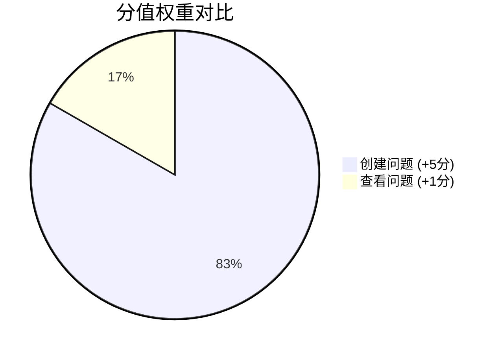
```mermaid
pie title 分值权重对比
    "创建问题 (+5分)" : 83.3
    "查看问题 (+1分)" : 16.7
```

| 用户行为 | 分值变化 | 权重说明 |
|---------|---------|---------|
| **查看某知识点下的问题** | **+1分** | 低权重，表示轻度兴趣 |
| **在某知识点下创建新问题** | **+5分** | 高权重，表示强需求/学习意愿 |

**设计理念：**
- 创建问题比单纯浏览更有价值（5倍权重）
- 鼓励用户参与和贡献内容
- 反映真实的社区活跃度

### 5.3 Redis数据结构设计

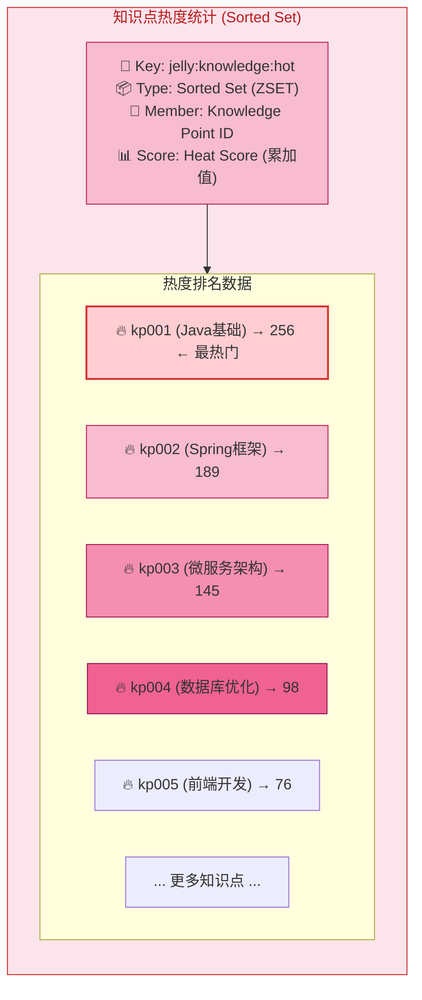
```mermaid
graph TB
    subgraph KPHot["知识点热度统计 (Sorted Set)"]
        direction TB
        
        KPInfo["📍 Key: jelly:knowledge:hot<br/>📦 Type: Sorted Set (ZSET)<br/>🎯 Member: Knowledge Point ID<br/>📊 Score: Heat Score (累加值)"]
        
        subgraph KPData["热度排名数据"]
            KP1["🔥 kp001 (Java基础) → 256 ← 最热门"]
            KP2["🔥 kp002 (Spring框架) → 189"]
            KP3["🔥 kp003 (微服务架构) → 145"]
            KP4["🔥 kp004 (数据库优化) → 98"]
            KP5["🔥 kp005 (前端开发) → 76"]
            KPn["... 更多知识点 ..."]
        end
    end
    
    KPInfo --> KPData
    
    style KPHot fill:#fce4ec,stroke:#c62828,color:#b71c1c
    style KPInfo fill:#f8bbd0,stroke:#c2185b
    style KP1 fill:#ffcdd2,stroke:#d32f2f,stroke-width:2px
    style KP2 fill:#f8bbd0,stroke:#c2185b
    style KP3 fill:#f48fb1,stroke:#ad1457
    style KP4 fill:#f06292,stroke:#880e4f
```

### 5.4 数据采集时序图

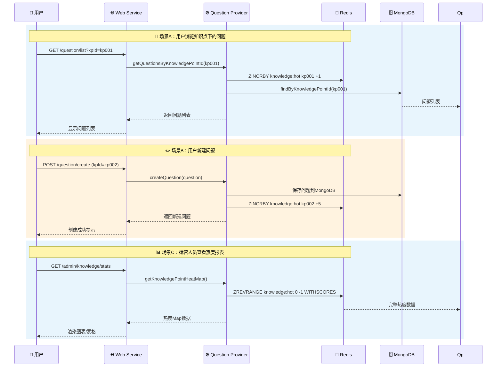
```mermaid
sequenceDiagram
    participant User as 👤 用户
    participant Web as 🌐 Web Service
    participant QP as ⚙️ Question Provider
    participant Redis as 💾 Redis
    participant DB as 🗄️ MongoDB

    rect rgb(232, 245, 253)
        Note over User,Redis: 📖 场景A：用户浏览知识点下的问题
        User->>Web: GET /question/list?kpId=kp001
        Web->>QP: getQuestionsByKnowledgePointId(kp001)
        QP->>Redis: ZINCRBY knowledge:hot kp001 +1
        QP->>DB: findByKnowledgePointId(kp001)
        DB-->>Qp: 问题列表
        QP-->>Web: 返回问题列表
        Web-->>User: 显示问题列表
    end

    rect rgb(255, 243, 224)
        Note over User,Redis: ✏️ 场景B：用户新建问题
        User->>Web: POST /question/create (kpId=kp002)
        Web->>QP: createQuestion(question)
        QP->>DB: 保存问题到MongoDB
        QP->>Redis: ZINCRBY knowledge:hot kp002 +5
        QP-->>Web: 返回新建问题
        Web-->>User: 创建成功提示
    end

    rect rgb(232, 245, 253)
        Note over User,Redis: 📊 场景C：运营人员查看热度报表
        User->>Web: GET /admin/knowledge/stats
        Web->>QP: getKnowledgePointHeatMap()
        QP->>Redis: ZREVRANGE knowledge:hot 0 -1 WITHSCORES
        Redis-->>Qp: 完整热度数据
        QP-->>Web: 热度Map数据
        Web-->>User: 渲染图表/表格
    end
```

### 5.5 核心实现代码

```java
// RedisCacheService.java
// 记录知识点访问 (+1分)
public void recordKnowledgePointAccess(String knowledgePointId) {
    try {
        stringRedisTemplate.opsForZSet()
            .incrementScore(KNOWLEDGE_HOT_KEY, knowledgePointId, 1);
        log.debug("📚 知识点访问: {} (+1)", knowledgePointId);
    } catch (Exception e) {
        log.error("❌ 记录知识点访问失败", e);
    }
}

// 记录新建问题 (+5分)
public void recordKnowledgePointQuestionCreated(String knowledgePointId) {
    try {
        stringRedisTemplate.opsForZSet()
            .incrementScore(KNOWLEDGE_HOT_KEY, knowledgePointId, 5);
        log.info("📝 知识点新问题: {} (+5)", knowledgePointId);
    } catch (Exception e) {
        log.error("❌ 记录知识点问题创建失败", e);
    }
}

// 获取Top N热门知识点
public Set<ZSetOperations.TypedTuple<String>> getHotKnowledgePoints(int limit) {
    return stringRedisTemplate.opsForZSet()
        .reverseRangeWithScores(KNOWLEDGE_HOT_KEY, 0, limit - 1);
}

// 获取完整热度图（用于可视化）
public Map<String, Double> getKnowledgePointHeatMap() {
    Set<ZSetOperations.TypedTuple<String>> allKps =
        stringRedisTemplate.opsForZSet()
            .reverseRangeWithScores(KNOWLEDGE_HOT_KEY, 0, -1);
    
    Map<String, Double> heatMap = new LinkedHashMap<>();
    if (allKps != null) {
        allKps.forEach(kp -> heatMap.put(kp.getValue(), kp.getScore()));
    }
    return heatMap;
}
```

### 5.6 在业务代码中的集成点

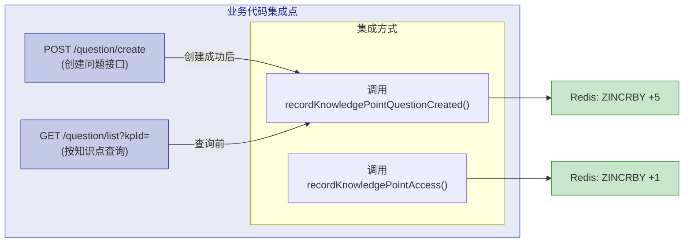
```mermaid
flowchart LR
    subgraph BusinessCode["业务代码集成点"]
        direction TB
        
        CreateAPI["POST /question/create<br/>(创建问题接口)"]
        ListAPI["GET /question/list?kpId=<br/>(按知识点查询)"]
        
        subgraph Integration["集成方式"]
            I1["调用recordKnowledgePointQuestionCreated()"]
            I2["调用recordKnowledgePointAccess()"]
        end
    end
    
    CreateAPI -->|"创建成功后"| I1
    ListAPI -->|"查询前"| I1
    
    I1 --> RedisOp1["Redis: ZINCRBY +5"]
    I2 --> RedisOp2["Redis: ZINCRBY +1"]
    
    style BusinessCode fill:#e8eaf6,stroke:#3949ab,color:#1a237e
    style CreateAPI fill:#c5cae9,stroke:#303f9f
    style ListAPI fill:#c5cae9,stroke:#303f9f
    style RedisOp1 fill:#c8e6c9,stroke:#388e3c
    style RedisOp2 fill:#c8e6c9,stroke:#388e3c
```

```java
// QuestionServiceImpl.java

@Override
public Question createQuestion(Question question) {
    // ... 创建问题逻辑 ...
    Question saved = questionRepository.save(question);

    // 【集成点1】记录知识点新问题事件
    if (question.getKnowledgePointId() != null) {
        redisCacheService.recordKnowledgePointQuestionCreated(
            question.getKnowledgePointId()
        );
    }

    return saved;
}

@Override
public List<Question> getQuestionsByKnowledgePointId(String kpId) {
    // 【集成点2】记录知识点访问事件
    redisCacheService.recordKnowledgePointAccess(kpId);

    return questionRepository.findByKnowledgePointId(kpId);
}
```

### 5.7 API接口示例

```bash
# 获取Top 10热门知识点
GET http://localhost:8082/api/redis/hot-knowledge-points?limit=10

# 响应:
[
  {"value": "kp001", "score": 256.0},
  {"value": "kp002", "score": 189.0},
  ...
]

# 获取完整热度图（用于管理后台图表）
GET http://localhost:8082/api/redis/knowledge-points

# 响应:
{
  "kp001": 256.0,
  "kp002": 189.0,
  "kp003": 145.0,
  ...
}

# 重置统计数据（测试环境使用）
POST http://localhost:8082/api/redis/reset-knowledge-stats
```

---

## 6. 时序图与交互流程

### 6.1 完整的用户请求处理流程

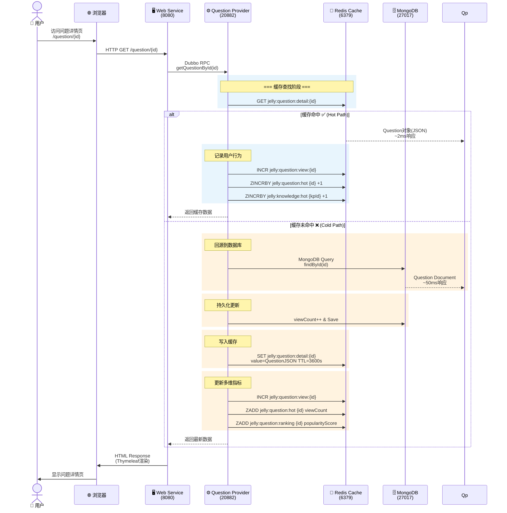
```mermaid
sequenceDiagram
    actor User as 👤 用户
    participant Browser as 🌐 浏览器
    participant Web as 🖥️ Web Service<br/>(8080)
    participant QP as ⚙️ Question Provider<br/>(20882)
    participant Redis as 💾 Redis Cache<br/>(6379)
    participant DB as 🗄️ MongoDB<br/>(27017)

    User->>Browser: 访问问题详情页<br/>/question/{id}
    Browser->>Web: HTTP GET /question/{id}

    Web->>QP: Dubbo RPC<br/>getQuestionById(id)

    rect rgb(232, 245, 253)
        Note over Redis,QP: === 缓存查找阶段 ===
        QP->>Redis: GET jelly:question:detail:{id}
    end

    alt 缓存命中 ✅ (Hot Path)
        Redis-->>Qp: Question对象(JSON)<br/>~2ms响应
        
        rect rgb(232, 245, 253)
            Note over QP: 记录用户行为
            QP->>Redis: INCR jelly:question:view:{id}
            QP->>Redis: ZINCRBY jelly:question:hot {id} +1
            QP->>Redis: ZINCRBY jelly:knowledge:hot {kpId} +1
        end
        
        QP-->>Web: 返回缓存数据
    else 缓存未命中 ❌ (Cold Path)
        rect rgb(255, 243, 224)
            Note over QP: 回源到数据库
            QP->>DB: MongoDB Query<br/>findById(id)
            DB-->>Qp: Question Document<br/>~50ms响应
        end
        
        rect rgb(255, 243, 224)
            Note over QP: 持久化更新
            QP->>DB: viewCount++ & Save
        end
        
        rect rgb(255, 243, 224)
            Note over QP: 写入缓存
            QP->>Redis: SET jelly:question:detail:{id}<br/>value=QuestionJSON TTL=3600s
        end
        
        rect rgb(255, 243, 224)
            Note over QP: 更新多维指标
            QP->>Redis: INCR jelly:question:view:{id}
            QP->>Redis: ZADD jelly:question:hot {id} viewCount
            QP->>Redis: ZADD jelly:question:ranking {id} popularityScore
        end
        
        QP-->>Web: 返回最新数据
    end

    Web->>Browser: HTML Response<br/>(Thymeleaf渲染)
    Browser->>User: 显示问题详情页
```

### 6.2 点赞操作的完整流程

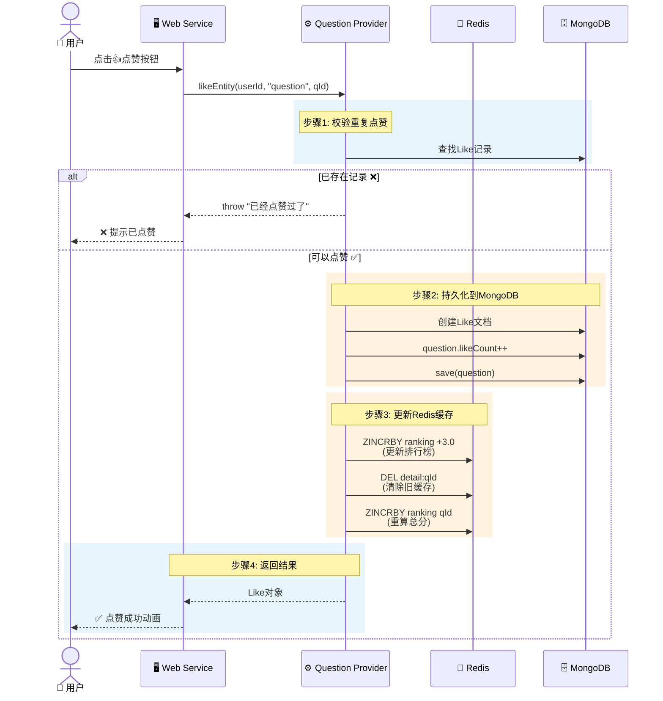
```mermaid
sequenceDiagram
    actor User as 👤 用户
    participant Web as 🖥️ Web Service
    participant QP as ⚙️ Question Provider
    participant Redis as 💾 Redis
    participant DB as 🗄️ MongoDB

    User->>Web: 点击👍点赞按钮
    Web->>QP: likeEntity(userId, "question", qId)

    rect rgb(232, 245, 253)
        Note over QP: 步骤1: 校验重复点赞
        QP->>DB: 查找Like记录
    end

    alt 已存在记录 ❌
        QP-->>Web: throw "已经点赞过了"
        Web-->>User: ❌ 提示已点赞
    else 可以点赞 ✅
        rect rgb(255, 243, 224)
            Note over QP,DB: 步骤2: 持久化到MongoDB
            QP->>DB: 创建Like文档
            QP->>DB: question.likeCount++
            QP->>DB: save(question)
        end
        
        rect rgb(255, 243, 224)
            Note over QP,Redis: 步骤3: 更新Redis缓存
            QP->>Redis: ZINCRBY ranking +3.0<br/>(更新排行榜)
            QP->>Redis: DEL detail:qId<br/>(清除旧缓存)
            QP->>Redis: ZINCRBY ranking qId<br/>(重算总分)
        end
        
        rect rgb(232, 245, 253)
            Note over QP,Web: 步骤4: 返回结果
            QP-->>Web: Like对象
            Web-->>User: ✅ 点赞成功动画
        end
    end
```

### 6.3 热点问题推荐的加载流程

```mermaid
sequenceDiagram
    participant User as 👤 用户
    participant Web as 🖥️ Web Service
    participant QP as ⚙️ Question Provider
    participant Redis as 💾 Redis
    participant DB as 🗄️ MongoDB

    User->>Web: 访问首页/推荐页
    Web->>QP: getRecommendedQuestions(page=0, size=10)

    rect rgb(232, 245, 253)
        Note over QP,Redis: 尝试从Redis获取热点
        QP->>Redis: ZREVRANGE jelly:question:hot 0 19
    end

    alt 有热点数据 ✅
        Redis-->>Qp: ["q001", "q002", ..., "q020"]
        
        loop 遍历每个热点ID
            rect rgb(232, 245, 253)
                QP->>Redis: GET hot:{qid}
                
                alt 热点详情缓存命中
                    Redis-->>Qp: Question数据
                else 缓存未命中
                    QP->>DB: findById(qid)
                    DB-->>Qp: Question
                    QP->>Redis: SET hot:{qid} TTL=1800s
                end
            end
        end
        
        QP-->>Web: 热点问题列表(优先展示)
    else 无热点数据 ❌
        rect rgb(255, 243, 224)
            Note over QP: 降级到默认策略
            QP->>DB: findAllByOrderByCreateTimeDesc
            DB-->>Qp: 最新问题列表
            QP-->>Web: 默认推荐列表
        end
    end

    Web-->>User: 展示推荐问题卡片
```

### 6.4 缓存一致性的保障机制

```mermaid
flowchart TD
    Start["写操作触发"] --> A{"操作类型?"}
    
    A -->|更新问题| B["更新MongoDB"]
    A -->|删除问题| C["删除MongoDB"]
    A -->|点赞/取消| D["更新Like状态"]
    
    B --> E["DEL Redis缓存<br/>detail:{id}"]
    C --> F["ZREM hot {id}<br/>DEL detail:{id}<br/>ZREM ranking {id}"]
    D --> G["ZINCRBY ranking ±3.0"]
    
    E --> H["下次读时回源<br/>保证最终一致"]
    F --> I["完全清理<br/>无脏数据风险"]
    G --> J["实时更新<br/>排行榜准确"]
    
    H --> K["✅ 一致性保障完成"]
    I --> K
    J --> K
    
    style Start fill:#e1f5fe,stroke:#0288d1
    style K fill:#c8e6c9,stroke:#43a047
    style B fill:#fff9c4,stroke:#f9a825
    style C fill:#ffcdd2,stroke:#c62828
    style D fill:#e8eaf6,stroke:#3949ab
```

---

## 7. 配置参数说明

### 7.1 application.yml 配置

```yaml
server:
  port: 8082

spring:
  application:
    name: jellystudy-question-provider
  
  # MongoDB配置
  data:
    mongodb:
      uri: mongodb://localhost:27017/jellystudy
      auto-index-creation: true
  
  # Redis配置
  redis:
    host: localhost
    port: 6379
    password:                    # 无密码
    database: 0                  # 使用DB 0
    lettuce:
      pool:
        max-active: 8            # 最大连接数
        max-idle: 8              # 最大空闲连接
        min-idle: 0              # 最小空闲连接
        max-wait: -1ms           # 获取连接最大等待时间
      shutdown-timeout: 100ms    # 关闭超时

  # Zipkin调用链配置
  zipkin:
    base-url: http://localhost:9411
    enabled: true
  sleuth:
    sampler:
      probability: 1.0

dubbo:
  application:
    name: jellystudy-question-provider
  protocol:
    name: dubbo
    port: 20882
  registry:
    address: nacos://localhost:8848
  scan:
    base-packages: com.jellystudy.provider.service
  provider:
    timeout: 5000
    retries: 0

# 自定义Redis缓存配置
redis:
  cache:
    question-ttl: 3600          # 问题详情缓存TTL (秒) - 1小时
    hot-question-ttl: 1800      # 热点问题缓存TTL (秒) - 30分钟
    ranking-size: 20            # 排行榜显示数量
    hot-question-size: 50       # 热点池容量
    enabled: true               # 是否启用Redis缓存
```

### 7.2 参数调优建议

```mermaid
graph LR
    subgraph EnvConfig["环境配置建议"]
        direction TB
        
        Dev["🔧 开发环境"]
        Test["🧪 测试环境"]
        Prod["🏭 生产环境"]
    end
    
    Dev --> DevParams["question-ttl: 3600s (1h)<br/>hot-question-ttl: 1800s (30min)<br/>ranking-size: 20<br/>✅ 方便调试"]
    
    Test --> TestParams["question-ttl: 1800s (30min)<br/>hot-question-ttl: 600s (10min)<br/>ranking-size: 30<br/>✅ 快速验证一致性"]
    
    Prod --> ProdParams["question-ttl: 600s (10min)<br/>hot-question-ttl: 300s (5min)<br/>ranking-size: 50<br/>✅ 高一致性要求"]
    
    style EnvConfig fill:#f3e5f5,stroke:#7b1fa2,color:#4a148c
    style Dev fill:#e8eaf6,stroke:#3949ab
    style Test fill:#fff9c4,stroke:#f9a825
    style Prod fill:#ffebee,stroke:#c62828
```

| 环境 | question-ttl | hot-question-ttl | ranking-size | 说明 |
|------|-------------|------------------|--------------|------|
| **开发环境** | 3600s (1h) | 1800s (30min) | 20 | 方便调试 |
| **测试环境** | 1800s (30min) | 600s (10min) | 30 | 快速验证一致性 |
| **生产环境** | 600s (10min) | 300s (5min) | 50 | 高一致性要求 |

### 7.3 连接池配置说明

```mermaid
graph TB
    subgraph ConnectionPool["Lettuce 连接池架构"]
        direction TB
        
        App["Spring Application"]
        
        subgraph Pool["连接池"]
            direction LR
            Active["max-active: 8<br/>最大并发连接"]
            Idle["max-idle: 8<br/>最大空闲连接"]
            MinIdle["min-idle: 0<br/>最小空闲连接"]
            Wait["max-wait: -1ms<br/>获取等待时间"]
        end
        
        RedisServer["Redis Server<br/>(6379)"]
    end
    
    App --> Pool
    Pool --> RedisServer
    
    style ConnectionPool fill:#e0f2f1,stroke:#00796b,color:#004d40
    style Pool fill:#b2dfdb,stroke:#00897b
```

| 参数 | 当前值 | 说明 | 调优建议 |
|------|-------|------|---------|
| `max-active` | 8 | 最大并发连接数 | 生产环境建议16-32 |
| `max-idle` | 8 | 最大空闲连接 | 与max-active相同 |
| `min-idle` | 0 | 最小空闲连接 | 建议2-4，避免冷启动 |
| `max-wait` | -1ms | 获取连接等待时间 | 建议设为2000ms |

---

## 8. 性能优化策略

### 8.1 性能对比

```mermaid
graph TB
    subgraph PerfChart["性能提升对比图"]
        direction TB
        subgraph YAxis["提升倍数"]
            direction LR
            P1["热点查询<br/>📈 25倍"]
            P2["排行榜生成<br/>📈 40倍"]
            P3["并发处理<br/>📈 35倍"]
            P4["数据库负载<br/>📈 75倍↓"]
            P5["P99延迟<br/>📈 10倍"]
        end
    end
    
    style PerfChart fill:#e3f2fd,stroke:#1565c0,color:#0d47a1
    style P1 fill:#c8e6c9,stroke:#388e3c
    style P2 fill:#a5d6a7,stroke:#43a047
    style P3 fill:#c8e6c9,stroke:#388e3c
    style P4 fill:#81c784,stroke:#2e7d32,stroke-width:2px
    style P5 fill:#c8e6c9,stroke:#388e3c
```

| 场景 | 优化前 (纯MongoDB) | 优化后 (Redis缓存) | 性能提升 |
|------|-------------------|-------------------|---------|
| **热点问题查询** | ~50ms (磁盘I/O) | ~2ms (内存读取) | **25倍** |
| **排行榜生成** | 全表扫描 ~200ms | ZSet范围查询 ~5ms | **40倍** |
| **并发处理能力** | 受限于DB连接池 | 几乎无限制 | **显著提升** |
| **数据库负载** | 所有请求打DB | 热点走缓存 | **降低70%+** |
| **P99延迟** | ~150ms | ~15ms | **10倍** |

### 8.2 优化措施清单

#### ✅ 已实施的优化

```mermaid
graph TB
    subgraph Optimizations["✅ 已实施的优化措施"]
        direction TB
        
        Root["🎯 已实施优化"]
        
        Root --> Cache["📦 多级缓存架构"]
        Cache --> L1["L1: 问题详情缓存(String)"]
        Cache --> L2["L2: 热点问题索引(ZSet)"]
        Cache --> L3["L3: 全局排行榜(ZSet)"]
        
        Root --> HotSpot["🔥 智能热点识别"]
        HotSpot --> HS1["自动追踪浏览行为"]
        HotSpot --> HS2["动态调整缓存内容"]
        HotSpot --> HS3["容量控制防止膨胀"]
        
        Root --> Batch["⚡ 批量操作优化"]
        Batch --> B1["Pipeline支持(可扩展)"]
        Batch --> B2["减少网络往返"]
        
        Root --> TTL["⏱️ 合理TTL设置"]
        TTL --> T1["平衡性能与一致性"]
        TTL --> T2["分级TTL策略"]
    end
    
    style Optimizations fill:#e8f5e9,stroke:#43a047,color:#1b5e20
    style Root fill:#c8e6c9,stroke:#2e7d32,stroke-width:2px
    style Cache fill:#bbdefb,stroke:#1976d2
    style HotSpot fill:#fff9c4,stroke:#fbc02d
    style Batch fill:#f8bbd0,stroke:#c2185b
    style TTL fill:#d1c4e9,stroke:#512da8
```

#### 🔧 可进一步优化的方向

```mermaid
flowchart LR
    Current["当前架构"] --> Future["未来优化方向"]
    
    Future --> Opt1["本地缓存(Caffeine)<br/>应用进程内再增一层<br/>进一步降低Redis频率"]
    Future --> Opt2["缓存预热<br/>系统启动时预加载热点<br/>避免冷启动穿透"]
    Future --> Opt3["异步更新<br/>先更新DB再异步刷Redis<br/>降低写延迟"]
    Future --> Opt4["布隆过滤器<br/>防止缓存穿透攻击<br/>快速判断key存在性"]
    
    style Current fill:#c8e6c9,stroke:#388e3c
    style Future fill:#fff9c4,stroke:#f9a825
    style Opt1 fill:#e3f2fd,stroke:#1976d2
    style Opt2 fill:#e8eaf6,stroke:#3949ab
    style Opt3 fill:#fce4ec,stroke:#c62828
    style Opt4 fill:#f3e5f5,stroke:#7b1fa2
```

### 8.3 内存使用估算

假设系统有 **10,000个问题**，其中 **500个为热点**：

```mermaid
pie title 内存使用分布
    "排行榜(ZSet)" : 31
    "热点索引(ZSet)" : 3
    "问题详情(String)" : 62
    "浏览计数器" : 2
    "知识点热度" : 2
```

| Key类型 | 数量 | 单条大小 | 总内存 |
|---------|------|---------|--------|
| 排行榜 (ZSet) | 1 | ~500KB | ~0.5MB |
| 热点索引 (ZSet) | 1 | ~40KB | ~40KB |
| 问题详情缓存 (String) | 500 | ~2KB | ~1MB |
| 浏览计数器 (String) | 500 | ~50B | ~25KB |
| 知识点热度 (ZSet) | 1 | ~10KB | ~10KB |
| **总计** | - | - | **~1.6MB** |

```mermaid
graph TB
    subgraph MemoryUsage["内存使用可视化 (总计 ~1.6MB)"]
        direction TB
        
        Bar1["📊 排行榜 ████████████████████ 0.5MB (31%)"]
        Bar2["📄 问题详情 ██████████████████████████████████████████████ 1MB (62%)"]
        Bar3["🔥 热点索引 ██ 0.04MB (3%)"]
        Bar4["🔢 浏览计数 █ 0.025MB (2%)"]
        Bar5["📚 知识点热度 █ 0.01MB (2%)"]
    end
    
    style MemoryUsage fill:#e8f5e9,stroke:#43a047,color:#1b5e20
```

**结论**: 内存占用极低，即使数据量增长10倍也在可控范围内。
