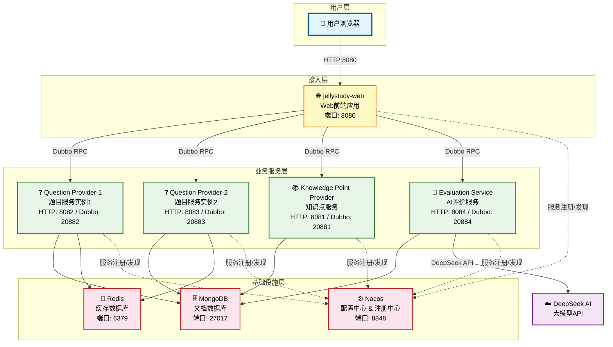
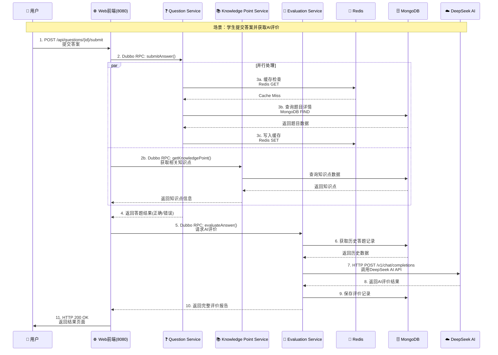
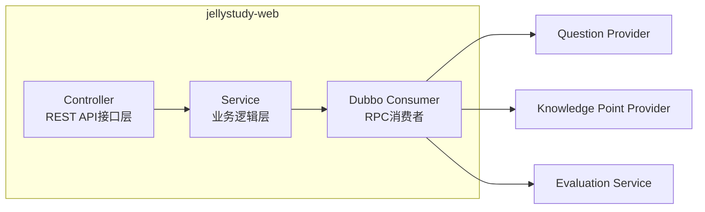
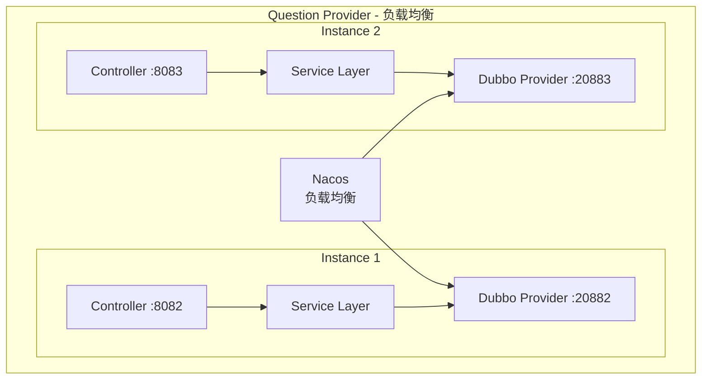
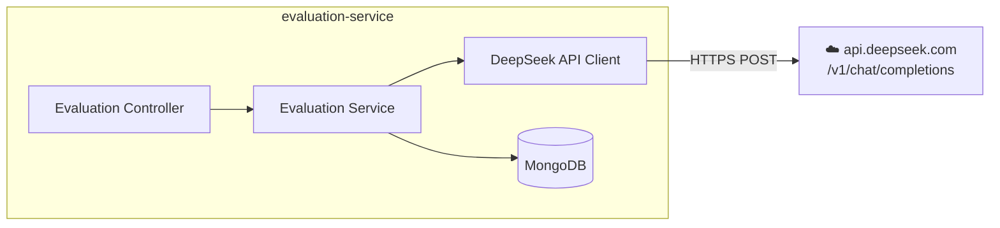
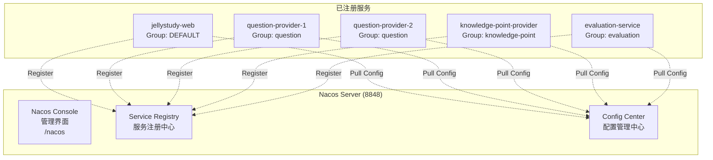
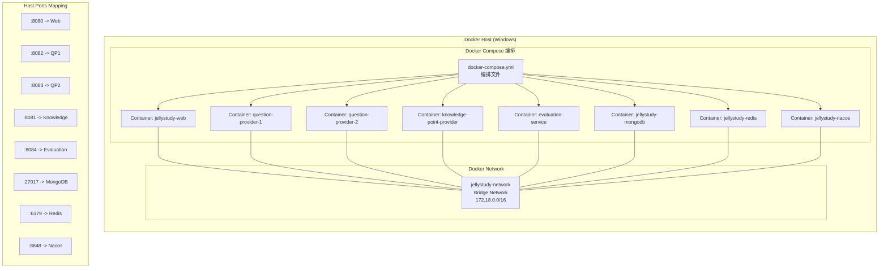
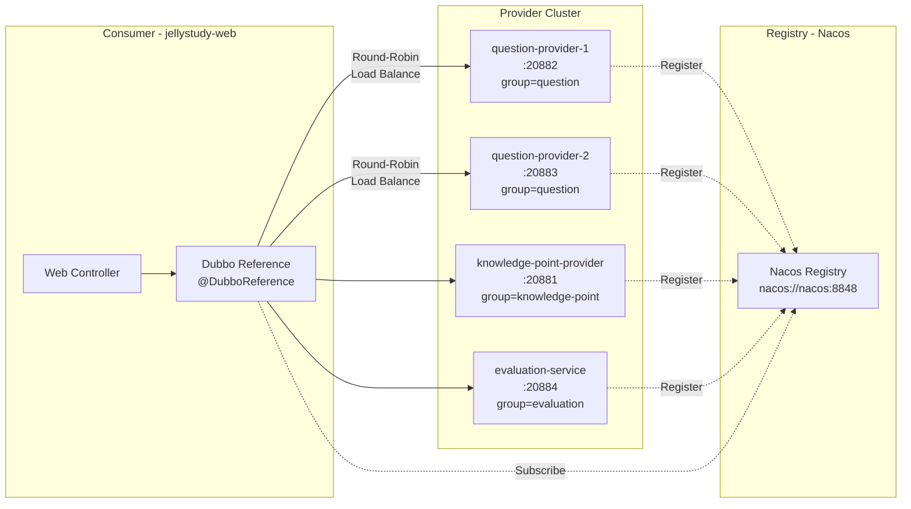
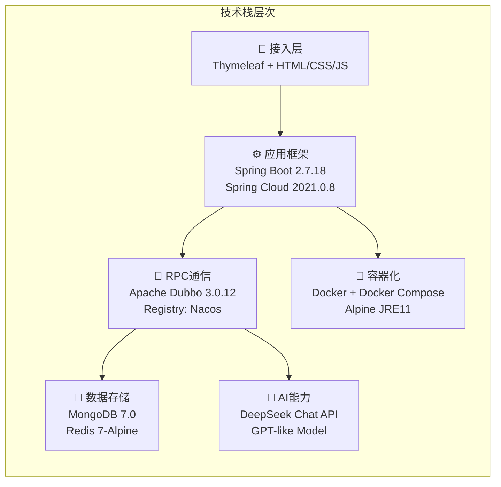

# JellyStudy 系统架构文档

## 📋 项目概述

**项目名称**: JellyStudy 智能学习平台
**技术架构**: 微服务架构（Dubbo + Spring Cloud）
**容器化**: Docker + Docker Compose
**部署状态**: ✅ 全部服务运行中

---

## 🏗️ 系统整体架构图



---

## 🔄 服务调用关系图



---

## 🎯 微服务详细说明

### 1️⃣ Web前端服务 (jellystudy-web)



| 属性 | 值 |
|------|-----|
| **服务名称** | jellystudy-web |
| **容器名称** | jellystudy-web |
| **HTTP端口** | 8080 |
| **Dubbo端口** | 无（纯消费者） |
| **职责** | 前端页面渲染、API网关、请求路由 |
| **技术栈** | Spring Boot + Thymeleaf + Dubbo Consumer |
| **镜像** | `jellystudy/web:latest` |

**主要功能：**
- 📄 提供Web界面（Thymeleaf模板）
- 🔄 作为Dubbo消费者调用后端服务
- 📊 聚合多个服务的数据展示给用户

---

### 2️⃣ 题目服务 (question-provider) - 双实例部署



| 属性 | Instance 1 | Instance 2 |
|------|-----------|-----------|
| **容器名称** | question-provider-1 | question-provider-2 |
| **HTTP端口** | 8082 | 8083 |
| **Dubbo端口** | 20882 | 20883 |
| **实例名** | question-provider-1 | question-provider-2 |
| **镜像** | `jellystudy/question-provider:latest` | 同左 |

**主要功能：**
- ❓ 题目的CRUD操作
- 📝 答题逻辑处理
- 🎯 推荐题目算法
- 📊 学习进度统计
- 💾 Redis缓存热门题目

---

### 3️⃣ 知识点服务 (knowledge-point-provider)

| 属性 | 值 |
|------|-----|
| **服务名称** | jellystudy-knowledge-point-provider |
| **容器名称** | knowledge-point-provider |
| **HTTP端口** | 8081 |
| **Dubbo端口** | 20881 |
| **职责** | 知识点管理、分类、关联关系 |
| **镜像** | `jellystudy/knowledge-point-provider:latest` |

**主要功能：**
- 📚 知识点的增删改查
- 🏷️ 知识点分类管理
- 🔗 知识点关联关系维护
- 📈 热门知识点统计

---

### 4️⃣ AI评价服务 (evaluation-service)



| 属性 | 值 |
|------|-----|
| **服务名称** | jellystudy-evaluation-service |
| **容器名称** | evaluation-service |
| **HTTP端口** | 8084 |
| **Dubbo端口** | 20884 |
| **职责** | AI智能评价、答案分析 |
| **外部依赖** | DeepSeek AI API |
| **镜像** | `jellystudy/evaluation-service:latest` |

**主要功能：**
- 🤖 调用DeepSeek大模型进行智能评价
- 📝 学生答案质量分析
- 💡 个性化学习建议生成
- ⭐ 答案评分和反馈

---

## 🗄️ 数据存储架构

```mermaid
graph TB
    subgraph "MongoDB - 主数据库"
        direction TB
        M1[jellystudy 数据库]

        M1 --> Q[questions 集合<br/>题目数据]
        M1 --> KP[knowledge_points 集合<br/>知识点数据]
        M1 --> E[evaluations 集合<br/>评价记录]
        M1 --> U[users 集合<br/>用户数据]
        M1 --> H[history 集合<br/>学习历史]
    end

    subgraph "Redis - 缓存层"
        direction TB
        R1[Database 0]

        R1 --> RC[Cache:Questions<br/>题目缓存<br/>TTL: 3600s]
        R1 --> RH[Hot:Questions<br/>热门题目排行<br/>ZSET]
        R1 --> RS[Session:User{ID}<br/>用户会话<br/>TTL: 1800s]
        R1 --> RL[Lock:Distributed<br/>分布式锁<br/>TTL: 30s]
    end
```

### MongoDB集合设计

| 集合名称 | 用途 | 主要字段 |
|---------|------|---------|
| **questions** | 存储所有题目 | questionId, content, options, answer, difficulty, knowledgePointId |
| **knowledge_points** | 知识点定义 | nodeId, name, category, subject, prerequisites[] |
| **evaluations** | AI评价记录 | evaluationId, userId, questionId, score, feedback, aiResponse |
| **users** | 用户信息 | userId, username, profile, stats |
| **history** | 学习轨迹 | userId, action, timestamp, details |

### Redis数据结构

| Key模式 | 类型 | 用途 | TTL |
|---------|------|------|-----|
| `jelly:q:{id}` | String | 题目详情缓存 | 1小时 |
| `jelly:hot:questions` | ZSET | 热门题目排行榜 | 30分钟 |
| `jelly:user:{id}:session` | Hash | 用户会话信息 | 30分钟 |
| `jelly:lock:{resource}` | String | 分布式锁 | 30秒 |

---

## ⚙️ 服务注册与发现 (Nacos)



**Nacos配置项：**
- **地址**: http://localhost:8848/nacos
- **账号/密码**: nacos / nacos
- **命名空间**: public (默认)
- **分组**: DEFAULT_GROUP

---

## 🐳 Docker部署架构



### 容器资源分配

| 容器 | 内存限制 | 内存保留 | CPU限制 |
|------|---------|---------|--------|
| jellystudy-web | 512M | 256M | 默认 |
| question-provider-1/2 | 512M | 256M | 默认 |
| knowledge-point-provider | 512M | 256M | 默认 |
| evaluation-service | 512M | 256M | 默认 |
| mongodb | 512M | 256M | 默认 |
| redis | 256M | 128M | 默认 |
| nacos | 1024M | 512M | 默认 |

### 端口映射总览

| 内部端口 | 外部端口 | 服务 | 协议 |
|---------|---------|------|------|
| 8080 | 8080 | Web前端 | HTTP |
| 8081 | 8081 | 知识点服务 | HTTP |
| 8082 | 8082 | 题目服务实例1 | HTTP |
| 8083 | 8083 | 题目服务实例2 | HTTP |
| 8084 | 8084 | AI评价服务 | HTTP |
| 20881 | 20881 | 知识点服务 | Dubbo |
| 20882 | 20882 | 题目服务实例1 | Dubbo |
| 20883 | 20883 | 题目服务实例2 | Dubbo |
| 20884 | 20884 | AI评价服务 | Dubbo |
| 27017 | 27017 | MongoDB | TCP |
| 6379 | 6379 | Redis | TCP |
| 8848 | 8848 | Nacos | HTTP |
| 9848 | 9848 | Nacos gRPC | TCP |

---

## 🔗 Dubbo RPC通信协议



**Dubbo配置特性：**
- **协议**: dubbo (基于Netty)
- **序列化**: Hessian2
- **负载均衡**: RoundRobin (轮询)
- **集群策略**: Failover (故障转移)
- **超时时间**: 10000ms (消费者) / 5000ms (提供者)
- **重试次数**: 0 (避免重复提交)

---

## 📊 技术栈总览



### 核心依赖版本

| 技术 | 版本 | 用途 |
|------|------|------|
| Java | 11 (Temurin) | 运行环境 |
| Spring Boot | 2.7.18 | 应用框架 |
| Spring Cloud | 2021.0.8 | 微服务套件 |
| Apache Dubbo | 3.0.12 | RPC框架 |
| Nacos Client | 2.1.0 | 注册中心+配置中心 |
| Spring Data MongoDB | 3.4.12 | MongoDB驱动 |
| Spring Data Redis | 2.7.18 | Redis驱动 |
| Lettuce | 6.1.10 | Redis客户端 |
| Thymeleaf | 3.0.15 | 模板引擎 |
| DeepSeek API | v1 | AI大模型 |

---

## 🚀 快速启动指南

### 前置条件
- ✅ Docker Desktop 已安装并运行
- ✅ 项目源码在 `c:\onlywork\jellystudy`
- ✅ 所有服务镜像已构建完成

### 启动命令

```bash
# 1. 进入项目目录
cd c:\onlywork\jellystudy

# 2. 一键启动所有服务
docker compose up -d

# 3. 等待30-60秒让服务初始化完成

# 4. 访问应用
#    Web前端: http://localhost:8080
#    Nacos控制台: http://localhost:8848/nacos (nacos/nacos)
```

### 常用运维命令

```bash
# 查看所有容器状态
docker ps --format "table {{.Names}}\t{{.Status}}\t{{.Ports}}"

# 查看某个服务日志
docker logs jellystudy-web --tail 100 -f

# 重启某个服务
docker restart question-provider-1

# 停止所有服务
docker compose down

# 停止并删除数据（慎用！）
docker compose down -v

# 重新构建并启动
docker compose up -d --build
```

---

## 📈 系统监控与诊断

### 健康检查端点

每个Spring Boot服务都暴露了Actuator端点：

| 服务 | 健康检查URL | 说明 |
|------|------------|------|
| Web | http://localhost:8080/actuator/health | 前端服务健康状态 |
| Question Provider 1 | http://localhost:8082/actuator/health | 题目服务1健康状态 |
| Question Provider 2 | http://localhost:8083/actuator/health | 题目服务2健康状态 |
| Knowledge Point | http://localhost:8081/actuator/health | 知识点服务健康状态 |
| Evaluation | http://localhost:8084/actuator/health | AI评价服务健康状态 |

### 日志查看

```bash
# 实时查看Web服务日志
docker logs -f jellystudy-web

# 查看最近50行错误日志
docker logs knowledge-point-provider 2>&1 | grep -i error | tail -50

# 查看特定时间的日志
docker logs question-provider-1 --since 2026-05-27T12:00:00
```

---

## 🔒 架构设计原则

### 已实现的设计模式

| 模式 | 应用位置 | 说明 |
|------|---------|------|
| **微服务架构** | 整体系统 | 服务拆分、独立部署 |
| **负载均衡** | Question Provider | 双实例轮询 |
| **服务注册发现** | 所有服务 | Nacos动态管理 |
| **配置集中管理** | 所有服务 | Nacos Config |
| **缓存策略** | Question Provider | Redis热点数据缓存 |
| **API网关** | Web前端 | 统一入口、请求聚合 |
| **容器化部署** | 全部服务 | Docker标准化交付 |

### 扩展性考虑

- ➕ **水平扩展**: Question Provider可继续增加实例
- ➕ **数据库分片**: MongoDB支持Sharding
- ➕ **缓存集群**: Redis可升级为Cluster模式
- ➕ **消息队列**: 可引入RabbitMQ/Kafka解耦
- ➕ **服务网格**: 可集成Istio进行流量管理

---

## 📝 文档变更记录

| 版本 | 日期 | 作者 | 变更内容 |
|------|------|------|---------|
| v1.0 | 2026-05-27 | JellyStudy Team | 初始版本，记录当前系统架构 |
| v1.1 | 2026-05-27 | JellyStudy Team | 修复Mermaid语法错误 |

---

*本文档由系统自动生成，最后更新时间: 2026-05-27*
